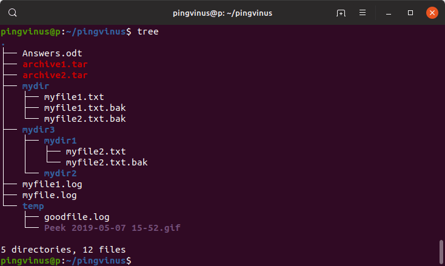

# tree-utility

*Tree_ok* is a recursive directory listing program that produces a depth indented listing of files. Color is supported ala dircolors if the LS_COLORS environment variable is set, output is to a tty, and the -C flag is used.  
With no arguments, *tree_ok* lists the files in the current directory. When directory arguments are given, *tree_ok* lists all the files and/or directories found in the given directories each in turn. Upon completion of listing all files/directories found, *tree_ok* returns the total number of files and/or directories listed.  

By default, when a symbolic link is encountered, the path that the symbolic link refers to is printed after the name of the link in the format:  

`name -> real-path`  

If the '-l' option is given and the symbolic link refers to an actual directory, then *tree_ok* will follow the path of the symbolic link as if it were a real directory.  

### Options   

*Tree_ok* understands the following command line switches:

**--help**  
Outputs a verbose usage listing.  

**--version**  
Outputs the version of *tree_ok*.

**-a**  
All files are printed. By default *tree_ok* does not print hidden files (those beginning with a dot '.'). In no event does *tree_ok* print the file system constructs '.' (current directory) and '..' (previous directory).

**-d**  
List directories only.

**-f**  
Prints the full path prefix for each file.

**-h**  
Print the size of each file but in a more human readable way, e.g. appending a size letter for kilobytes (K), megabytes (M), gigabytes (G), terrabytes (T), petabytes (P) and exabytes (E).

**-u**  
Print the username, or UID # if no username is available, of the file.

**-g**  
Print the group name, or GID # if no group name is available, of the file.

**-D**  
Print the date of the last modification time for the file listed.

**-C**  
Turn colorization on always, using built-in color defaults if the LS_COLORS environment variable is not set. Useful to colorize output to a pipe.

**-L** level  
Max display depth of the directory *tree_ok*.

